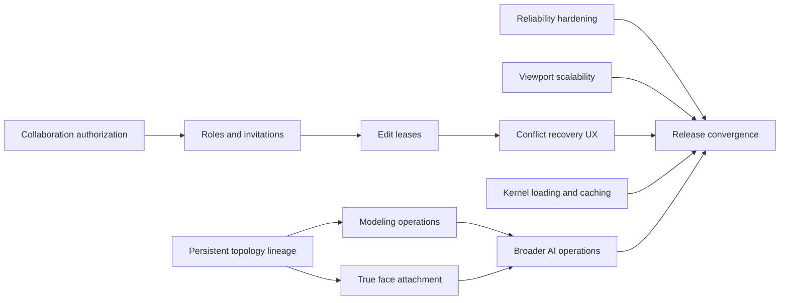

# OpenZCAD Implementation Plan

Status: revised after technical review (2026-07-31); review decisions resolved
Scope: reliability, viewport scalability, persistent topology, modeling breadth,
collaboration, AI operations, and exact-kernel delivery
Execution model: one integrator plus up to three parallel implementation agents

## Objective

Complete the next OpenZCAD milestones without weakening the browser document
model, exact-geometry guarantees, package boundaries, offline behavior, or
fail-closed topology handling.

The program should extend current capabilities rather than reimplement them.
Several roadmap items already have working foundations:

- Cloud settings autosave is largely shipped inline in `App.tsx`
  (`App.tsx:1612-1735`): debounced coalescing, request serialization,
  response-revision chaining, one 409 GET-plus-retry, flush before logout, and
  dirty-state preservation through reload all exist. Missing: offline
  pause/resume (a failed save is never rescheduled), a session-epoch guard
  (stale-response rejection keys on `userId` only), module extraction, and
  test coverage.
- The orientation cube supports face snapping and pointer-drag orbiting with a
  4 px drag threshold. Missing: `lostpointercapture`, window-blur, and
  unmount-mid-drag cleanup.
- Schema v4 includes face-attached sketch plane references, but they are
  snapshot-only: `frameForPlaneRef` returns the stored frame verbatim and the
  fingerprint fields are written once and never read.
- Multi-profile extrusion is implemented on both kernels.
- Planar face offsets work through BrepKit and OpenCascade.
- BrepKit supports cylindrical hole and boss radius edits (BrepKit-only; the
  OCCT adapter rejects them).
- Imported complete through-holes support recognition, resize, and removal
  (OCCT-only; BrepKit refuses them).
- ADR-011 cross-kernel fingerprints are implemented and fail closed on
  zero-or-many matches. The closed-B-spline/NURBS exclusion is emergent
  (weak signatures fail only on ambiguous twins), not an explicit guard.
- Collaboration rooms already provide presence, history, merge/conflict
  detection, and persisted snapshots.
- The Durable Object contains dead, unpersisted lock scaffolding
  (`locks`/`setLock`/`joinSession`) with zero callers; lease work replaces
  it rather than extending it.

## Non-negotiable constraints

- The canonical `ProjectDocument` and command history remain the source of
  truth.
- Geometry evaluation stays inside browser workers.
- Viewport code never mutates document or kernel state.
- Exact edits may not be authorized by tessellated or mesh-derived
  measurements.
- Ambiguous, stale, invalid, or unsupported topology fails visibly without
  modifying the document.
- Existing schema-v4 documents and serialized commands remain readable.
- Units and tolerances must be explicit and scale-aware, with one carve-out:
  ADR-011 fingerprint quantization (1e-6 document units,
  `topology-fingerprint.ts:26-28`) is frozen. Changing it invalidates every
  persisted topology hash; any future change requires dual-registration like
  the legacy BrepKit hashes. Scale-awareness applies to operation validation
  tolerances only.
- Collaboration permissions must be enforced server-side — including inside
  the Durable Object per message, not only at socket upgrade — never only
  through disabled UI controls.
- AI proposals must use the same deterministic command, preview, validation,
  and permission paths as manual edits.
- No production deployment target or production domain configuration is part
  of this program.

## Dependency graph

Persistent topology lineage is the critical path for modeling, face
attachment, and AI. Viewport, collaboration, reliability, and kernel-delivery
work can proceed alongside it.

## Parallel-agent operating model

There are four total execution slots:

1. **Integrator**
   - Owns shared contracts, schema versions, migrations, `App.tsx`,
     `ModelViewer.tsx`, the three single-file schema packages
     (`shared`, `document-core`, `command-system`), integration tests,
     commits, and pushes.
   - Reviews every public document/API change.
   - Resolves shared-file integration after each wave.
   - Performs the `App.tsx`/`ModelViewer.tsx` side of every extraction an
     agent prepares: agents deliver new modules plus tests; the integrator
     splices them into integrator-owned files.

2. **Implementation Agent A**
3. **Implementation Agent B**
4. **Implementation Agent C**

Agent assignments change by wave. Every task must include:

- an explicit file allowlist;
- required targeted tests;
- acceptance criteria;
- prohibited shared files;
- the base commit being reviewed.

Agents do not commit independently. The integrator reviews their changes,
runs the wave gate, and creates scoped commits on the current branch. No two
active agents may edit `apps/web/src/App.tsx`,
`packages/kernel-adapter/src/exact.ts`,
`packages/kernel-adapter/src/topology-fingerprint.ts`,
`packages/kernel-adapter/src/topology-lineage.ts` (once created), or shared
schema contracts simultaneously.

## Wave 0: Baselines and immediate hardening

### Integrator

- Refresh performance, draw-call, bundle, and kernel fixture baselines (the
  ~132-call Heat Sink draw-call baseline is already committed in
  `docs/performance-baseline.md`; extend, do not recreate).
- Install component-test infrastructure: a DOM test environment
  (jsdom or happy-dom) plus testing-library for the `apps/web` vitest
  project. Both vitest configs currently run `environment: 'node'`; no
  component test can be written until this lands.
- Introduce a typed boolean feature-flag helper on `CloudflareEnv`. The flags
  named under "Rollout controls" do not exist yet and the current codebase
  has no boolean-env parsing; this is new infrastructure.
- Split `test/e2e/openzcad.spec.ts` (3,453 lines) into domain-scoped spec
  files (settings, viewport, modeling, collaboration) so later waves can
  assign whole files, not "sections", to agents.
- Create a current capability/gap matrix and update stale documentation:
  `architecture.md` ("schema-v2"), `README.md` ("migrate to v3") — actual
  schema version is 4 — and the aspirational comment at
  `packages/shared/src/index.ts:170-173` claiming face-frame re-derivation
  that does not exist.
- Approve the topology-lineage ADR direction before schema implementation.
- Freeze shared semantics for mirror, shell, solid offset, roles, and leases
  (resolved defaults under "Approved decisions").

### Agent A: Cloud settings reliability

Likely ownership:

- new `apps/web/src/lib/cloudSettingsAutosave.ts`
- focused autosave unit tests
- the settings-domain e2e spec file

The integrator performs the `App.tsx` splice (refs at `:238-285`, effects at
`:577-600`, handlers at `:1612-1735`, call sites at `:678`, `:1805`,
`:1937-1949`, `:1974`).

Work (scoped to what is actually missing — coalescing, serialization,
revision chaining, 409 retry, logout flush, and reload preservation are
already shipped and must be preserved through extraction):

- Extract the account-save state machine from `App.tsx` into the new module.
  Two extraction landmines: `persistCloudSettings` uses reference identity
  (`appSettingsRef.current === next`) to decide freshness — preserve that
  contract or replace it with an explicit epoch; and the local-persist effect
  reads `syncedRevisionRef` as a side channel — the extracted module must
  expose that value.
- Add offline handling: pause bounded retry while offline and resume after
  the `online` event. Today a failed save re-pends its value but never
  re-arms a timer (`App.tsx:1714-1718` excludes it), so an outage stalls the
  write until the next unrelated edit.
- Add a session-epoch guard so a logout followed by re-login as the same
  user cannot adopt a pre-logout in-flight response (the current guard keys
  on `userId` only).

Acceptance:

- Ten rapid edits produce one final PATCH.
- An edit made during a PATCH produces one subsequent PATCH.
- A 409 performs GET plus one revision-safe retry, covered by tests on both
  the client path and the worker branches at
  `apps/web/worker/settings.ts:646-651` and `:671-676` (currently untested).
- An outage never loses the device copy, and reconnection retries without
  requiring a new edit.
- Logout does not silently discard a pending change.
- A response from a previous session epoch is discarded.
- No stale success status or unhandled promise rejection occurs.

### Agent B: Orientation cube reliability

Likely ownership:

- `apps/web/src/components/OrientationWidget.tsx`
- `packages/viewport/src/camera/CameraController.ts`
- `apps/web/src/styles/components/viewport-overlays.css`
- focused component/E2E tests (depends on the integrator's component-test
  infrastructure landing first)

Work (face snapping, drag orbiting, and the 4 px threshold are shipped; the
gaps are lifecycle edges):

- Add the missing `lostpointercapture` handler (zero hits repo-wide today),
  window-blur handling, and unmount-mid-drag cleanup (the only current
  cleanup nulls a ref at `OrientationWidget.tsx:190-192`; a stuck
  `dragRef` blocks all future drags).
- Verify cleanup and damping completion on `CameraController`.
- Cover mouse, touch, and pen input.
- Cover perspective, orthographic, desktop, and compact viewports.
- Retain keyboard face activation.

Acceptance:

- Movement below the 4 px drag threshold performs exactly one face snap
  (a sub-threshold wobble test — the existing e2e drag moves 42 px and never
  exercises the boundary).
- Movement above the threshold orbits and suppresses face snapping.
- Cancellation, lost capture, blur, and unmount cannot leave a stuck drag.
- Projection mode, target, and finite camera distance are preserved.
- The interaction never scrolls the page or logs an error.

### Agent C: Topology-lineage spike

Likely ownership:

- new ADR under `docs/adrs`
- experimental tests or an isolated topology-lineage module

Work — the spike must answer three questions explicitly, because the pinned
kernel's evolution surface is narrower than lineage requires:

1. **Geometric-matching acceptability.** The pinned brepkit-wasm commit
   exposes `fuseWithEvolution`, `cutWithEvolution`, `intersectWithEvolution`,
   and `filletWithEvolution`, but the fillet variant documents its provenance
   as matched geometrically (face normal + centroid) — exactly the
   nearest-geometry matching this plan forbids as a resolution strategy.
   The spike must decide whether kernel-side matching is acceptable lineage
   *input* when re-verified with ADR-011-style quantized exact comparisons,
   or whether a kernel bridge change is required.
2. **Coverage gaps.** No evolution API exists for chamfer, pattern, or
   direct edits. Identify which operations need new BrepKit bridge APIs and
   which can be derived (e.g. transforms are one-to-one).
3. **The `deleted` channel.** The typed `EvolutionResult` carries only
   `generated`/`modified`; deleted topology appears only in the untyped JSON
   docs of the fillet variant, and all four methods return `any`. Determine
   how deletions are detected reliably.

Also:

- Test representative primitive, sweep, transform, boolean, fillet, and
  chamfer edits in both pinned kernels.
- Propose an additive schema-v5 reference contract, including a per-kind
  definition of the exact geometric witness.
- Propose an explicit surface-class guard for closed B-spline/NURBS faces:
  today their exclusion is emergent (a lone closed B-spline face with a
  matching perimeter resolves via its weak signature), and "must fail
  closed" needs to become enforced behavior, not an accident of ambiguity
  detection.

### Wave 0 gate

- Reliability tests pass, including the new worker-side settings 409 tests.
- Component-test infrastructure runs in CI.
- Current baselines are refreshed and the e2e spec split is complete.
- The topology-lineage spike answers all three questions above and
  demonstrates a safe implementation path or clearly identifies the required
  kernel bridge. Wave 2 lineage scope is conditional on these answers.
- Product decisions listed under "Approved decisions" are confirmed.

## Wave 1: Independent foundations

### Agent A: Viewport edge consolidation

Primary ownership:

- `packages/viewport/src/render/scene.ts`
- new `packages/viewport/src/render/edgeOverlay.ts`
- `packages/viewport/src/pick/PickService.ts`
- `packages/viewport/src/selection/SelectionManager.ts`
- viewport tests

The per-edge `Line2` loop being replaced lives in the integrator-owned
`ModelViewer.tsx` (`:3384-3415`), not in the viewport package. The handoff:
Agent A builds the batch builder in `edgeOverlay.ts` (the batched primitive
`createFatLineSegments` at `scene.ts:314-323` already exists and is used for
topology-less bodies); the integrator performs the `ModelViewer.tsx` swap as
part of the effect split it owns.

Work:

- Convert each body's renderable edge polylines into one idle-edge batch.
- Maintain segment-index to `{bodyId, topologyId, hash}` ownership (this
  metadata currently rides on per-edge `userData`).
- Keep hover and selected edges in small reusable overlay batches. The
  in-place mutation pattern to extend already exists for hover
  (`SelectionManager.ts:110-138`).
- Preserve body-scoped visibility and seam filtering
  (`shouldRenderTopologyEdge`, `objects.ts:43-46`).
- Change selection visuals without rebuilding body geometry.

The integrator owns the final `ModelViewer.tsx` effect split:

- geometry effect keyed by bodies;
- selection effect keyed by selected topology.

Acceptance:

- Idle edge rendering uses at most one draw call per visible body.
- Selection changes do not dispose body geometry, recreate materials, or
  invalidate the frozen shadow map (all three currently happen:
  `ModelViewer.tsx:3359-3360`, `:3396-3402`, `:3622`). Camera refit is
  already guarded today (`:3664`) and must stay guarded.
- Edge/face picking, depth cycling, box selection, snapping, hidden bodies,
  wireframe, hover, and multi-edge selection remain correct.
- Performance probes show a material draw-call reduction from the recorded
  ~132-call Heat Sink baseline (`docs/performance-baseline.md:69-80`) with
  no p95 frame-time regression, measured on the same reference hardware via
  `interaction-probe`.

### Agent B: Collaboration authorization

Primary ownership:

- new migration `apps/web/migrations/0008_project_sharing.sql`
- persistence authorization helpers
- Worker authorization tests

Proposed data:

- `project_members`
- `project_invitations`
- `project_access_events`
- nullable revision `author_user_id`

Roles:

- `owner`
- `editor`
- `viewer`

Work:

- Keep `projects.user_id` and `ProjectDocument.ownerUserId` authoritative and
  immutable.
- Add centralized `requireProjectRead`, `requireProjectEdit`, and
  `requireProjectOwner` checks (none exist today; authorization is per-query
  `user_id` binding plus a private `assertProjectOwner` duplicated in two
  persistence implementations).
- Apply them to project, revision, artifact, upload, collaboration, and
  sharing routes.
- Preserve `404` behavior for unauthorized resources, and fix the one
  anomaly: `GET /api/artifacts/:id` currently returns 200 with
  `{"artifact": null}` for non-owned artifacts
  (`apps/web/worker/index.ts:477-482`) instead of 404. Decide and test the
  behavior now so parity tests do not enshrine the inconsistency.
- Extend the worker→Durable Object trusted-header contract to carry the
  resolved role, so Wave 2 lease work can enforce it inside the DO.

Acceptance:

- Existing owners retain identical behavior.
- Viewers fail every mutation when bypassing the UI.
- Editors can save without changing document ownership.
- Unrelated projects remain undiscoverable.

### Agent C: Additive topology contracts

Primary ownership after ADR approval:

- new `packages/kernel-adapter/src/topology-lineage.ts`
- topology contract tests

Integrator-owned shared changes:

- `packages/shared/src/index.ts`
- `packages/document-core/src/index.ts`
- `packages/command-system/src/index.ts`
- migrations and replay compatibility

New topology references should include:

- topology kind;
- producing feature identity;
- stable lineage name;
- current ADR-011 hash;
- exact geometric witness used for fail-closed validation (per-kind
  definition frozen in the ADR).

Resolution order:

1. unique compatible lineage;
2. unique ADR-011 hash for legacy references;
3. visible failure.

Nearest-geometry matching, traversal order, and silent rebinding remain
forbidden as resolution strategies. Kernel-provided evolution data that is
internally matched geometrically may only be consumed if re-verified per the
Wave 0 spike's approved method.

### Wave 1 gate

- Schema-v4 projects replay unchanged.
- New lineage references serialize, undo, redo, and collaborate correctly.
- Existing authorization behavior passes parity tests (including the
  resolved artifact-metadata behavior).
- Viewport batching meets its correctness and performance targets.

## Wave 2: Lineage, roles, leases, and worker lifecycle

Scope for Agents A and B is conditional on the Wave 0 spike: operations
without a safe lineage source (chamfer, pattern, direct edits at minimum,
absent a bridge change) ship as explicit "no lineage — hash fallback only"
rather than blocking the wave.

`topology-lineage.ts` and `topology-fingerprint.ts` are integrator-owned in
this wave; Agents A and B consume but do not edit them.

### Agent A: BrepKit lineage propagation

- Primitive semantic faces and edges.
- Extrude/revolve caps and source-profile sides.
- Transform one-to-one inheritance.
- Boolean and fillet propagation via the evolution APIs, re-verified per the
  approved spike method; chamfer, pattern, and direct-edit propagation only
  as the spike's bridge decision allows.
- Explicit split/merge/delete ambiguity diagnostics, including the strategy
  for detecting deletions given the missing typed `deleted` channel.

### Agent B: OpenCascade lineage propagation

- Equivalent semantic identity and propagation.
- Cross-kernel parity with BrepKit.
- STEP boundaries remain hash-only unless reliable feature provenance exists.
- Cross-kernel rerouting must preserve lineage or fail closed.
- Implement the explicit closed-B-spline/NURBS surface-class guard designed
  in Wave 0, with a test proving a lone weak-signature face fails closed
  instead of resolving.

### Agent C: Invitations, roles, and project lease

Additive APIs proposed for review:

- `GET /api/projects/:id/sharing`
- `POST /api/projects/:id/invitations`
- `DELETE /api/projects/:id/invitations/:inviteId`
- `PATCH /api/projects/:id/members/:userId`
- `DELETE /api/projects/:id/members/:userId`
- `POST /api/project-invitations/accept`

Invitation requirements:

- 256-bit opaque token; only its hash is persisted (reuse the shipped
  session-token pattern at `apps/web/worker/auth.ts:612-629` and the
  `auth_rate_limits` bucket precedent).
- Authenticated email must match the invitation email, normalized identically
  to the auth flow's normalization.
- Seven-day, single-use beta default.
- Conditional SQL prevents simultaneous acceptance/revocation.
- Rate limits and active member/invitation caps.
- Token and unnecessary email values never enter logs.

Edit lease protocol:

- Project-wide exclusive lease for owner/editor.
- Typed acquire, renew, release, grant, deny, and lost messages.
- Document and oversized snapshot writes require the active lease.
- Lease is bound to project, client, user, and expiry.
- Lease is persisted in Durable Object storage before broadcast, so DO
  eviction cannot mint a second editor. This replaces — and deletes — the
  dead `locks`/`setLock`/`joinSession` scaffolding, which has no callers and
  no persistence.
- Role checks execute inside the DO on every document and lease frame, using
  the role injected by the worker; presence-only header checks are not
  sufficient. Downgrade/removal revokes the lease immediately, including for
  already-open sockets.
- Viewers receive room updates but never author room state, enforced
  per-message in the DO.

Prerequisite: the beta config binds no `PROJECT_ROOM` Durable Object today
(root `wrangler.jsonc`), so collaboration 501s in beta. Add the binding to
the non-production config before lease rollout steps.

### Integrator: Worker lifecycle and request ordering

Add typed worker states:

- `starting`
- `loading-brepkit`
- `loading-occt`
- `rebuilding`
- `ready`
- `failed`

BrepKit is currently loaded eagerly at worker module scope, so
`loading-brepkit` is defined here as a forward-compatible state the worker
may pass through instantly; it becomes meaningful when Wave 5 makes BrepKit
lazy. Today's worker (135 lines) has no state machine, no job queue, and
swallows kernel-load failure into a silent fallback.

Also:

- serialize exact worker jobs (the bare async `onmessage` handler currently
  lets jobs interleave and resolve out of order);
- coalesce superseded broadcast rebuilds;
- preserve explicit export and `syncOnce` promises;
- tag state with project/version/request IDs;
- retain the last valid projection while marking it stale;
- disable topology-dependent actions until matching exact state arrives.

### Wave 2 gate

- References survive upstream dimension edits and kernel reroutes when
  unambiguous.
- Deleted, split, or merged topology fails visibly; a lone closed
  B-spline/NURBS face fails closed under the new explicit guard.
- Parity-harness rebuild time stays within an agreed budget of the recorded
  baseline with lineage enabled (fingerprinting already runs per rebuild;
  evolution calls add JSON serialization cost).
- Exactly one editor can hold the project lease, including across DO
  eviction/restart.
- Forged, expired, cross-project, or other-client leases cannot write.
- Viewer mutations fail server-side, covered by socket-level attack tests
  (viewer sends a document frame; downgraded editor mid-session; forged
  identity headers) — the existing collaboration suite is transport-only.
- Worker UI never claims stale geometry is ready.

## Wave 3: Exact modeling operations

Hard gate before parallel work: extract narrowly scoped kernel-operation
modules from `exact.ts` (2,507 lines, no per-operation modules today) so
agents do not collide in it.

Note the current adapter asymmetry, which this wave's parity work must
resolve deliberately rather than assume: cylindrical hole/boss resize is
BrepKit-only, and imported through-hole operations are OCCT-only.

### Agent A: BrepKit mirror, shell, and solid offset

Use the pinned kernel's exact `mirror`, `shell`, and `offsetSolidV2` APIs
(all confirmed present in the pinned commit's typings; none currently used).

Validation:

- finite, normalized mirror plane;
- explicit original-plus-copy semantics without automatic fusion;
- positive shell thickness; zero, negative, and non-finite rejected in
  preflight;
- shared positive-outward offset sign; zero and non-finite rejected;
- unique opening-face references;
- nonempty, closed, valid solid;
- finite bounds and volume;
- refusal on self-intersection or thickness at or beyond local feature size;
- failed preflight leaves document and history untouched.

### Agent B: OpenCascade feature parity

- Mirror, shell, and uniform offset with identical adapter semantics.
- Generalized cylindrical resize for imported:
  - through holes;
  - blind holes;
  - bosses;
  - bounded axial spans.
- Verify analytic-cylinder result after replacement booleans.

### Agent C: Imported feature recognition

Recommended new module:

- `packages/kernel-adapter/src/imported-feature-recognition.ts`

Build an exact face-adjacency graph and initially recognize only:

1. blind cylindrical holes;
2. counterbores and countersinks;
3. cylindrical bosses;
4. prismatic pockets with depth editing;
5. conical tapers with the angle-authoritative invariant (see Approved
   decisions).

Return unsupported for blends, ribs, intersecting features, ambiguous twins,
partial revolutions, or incomplete proof.

### Integrator: Document and command contracts

Add first-class feature/operation contracts for:

- mirror;
- shell;
- uniform solid offset;
- recognized coordinated imported edits.

Freeze:

- body consumption and result ownership (a mirror copy is a new body with
  its own pre-assigned identity; fusion is composed via the existing boolean
  feature);
- parameter fields and expressions;
- sign conventions;
- selection requirements;
- taper invariant;
- replay and migration semantics.

### Wave 3 gate

Every operation passes:

- create, edit, undo, redo, delete, reload, and replay;
- BrepKit/OCCT conformance within scale-aware tolerances;
- valid STEP export and reimport;
- mm, cm, m, and inch coverage — note this extends current fixtures, which
  cover mm and inch only; cm and m fixtures are new work;
- transformed and rotated part fixtures;
- stale/ambiguous topology refusal;
- no document/history mutation after failed preflight.

## Wave 4: Product UI, true face attachment, and conflict recovery

### Agent A: True face-attached sketches

Depends on Wave 2 lineage (the evolved face is resolved at the sketch's
history position). The integrator performs the splices in
`packages/geometry` (`frameForPlaneRef`), `document-core`, and the `App.tsx`
write site.

- Resolve the planar source face at the sketch's history position.
- Rebuild its frame from evolved face center/normal and a deterministic
  in-plane axis.
- Follow valid transforms and dimensional changes.
- Retain the frame snapshot for migration and diagnostics. Correct the stale
  comment at `packages/shared/src/index.ts:170-173`; nothing currently reads
  the stored fingerprint fields, so there are no hidden dependents to
  migrate.
- Fail with the sketch and source feature named when the face disappears,
  becomes nonplanar, or is ambiguous.

### Agent B: Modeling UI components

Ownership excludes `App.tsx`:

- feature forms;
- inspector sections;
- topology labels;
- interaction capability/state modules;
- tool definitions;
- focused component tests (infrastructure from Wave 0).

UI:

- mirror, shell, and offset operations;
- opening-face selection;
- recognized imported-feature labels;
- coordinated editable dimensions;
- exact preflight and expression-valued numeric entry;
- explicit unsupported explanations.

### Agent C: Collaboration UI components

Ownership excludes `App.tsx`:

- API client additions;
- share dialog;
- member and invitation components;
- role indicators;
- lease state;
- conflict dialog;
- `useCollaboration` protocol extensions.

Conflict actions:

- **Use room version**
- **Keep my version**
- **Save local as a copy**

All destructive resolutions first preserve the divergent local document in
the existing IndexedDB project store. "Keep mine" requires an active lease
and expected room version. Today's conflict handling is a status string only;
this is new UX over the shipped server-side detection.

### Integrator

- Wire all component APIs into `App.tsx`.
- Add central `canEdit` enforcement around command execution, checkpointing,
  uploads, imports, and AI Apply.
- Unify AI preview and Apply preflight. This fixes a shipped divergence, not
  just a property of new operations: preview currently runs the compat
  kernel and skips union-connectivity validation, so a patch can preview
  clean and fail on Apply (`App.tsx:2235-2304`). It lands here because it
  hardens the existing twelve AI operations and gates Wave 5.
- Ensure role changes revoke active capabilities immediately.

### Wave 4 gate

- Face attachments follow valid source topology and never attach to a nearby
  face.
- Modeling forms and direct manipulation use identical exact preflight.
- AI preview and Apply run the same kernel path and the same validation.
- A conflict cannot enter an autosend loop.
- Reloading or closing conflict UI cannot destroy the local divergent copy,
  covered by a reload-survival e2e test.
- Viewers cannot acquire leases or choose "Keep my version."

## Wave 5: AI expansion, caching, and convergence

### Agent A: AI operation contracts

Add operations individually in this order. Note the current AI allowlist has
twelve operations and no direct-edit kind; item 1 means adding a new AI
contract over the already-proven manual `directEditBody` command path, not
exposing something that exists.

1. deterministic direct edits (new AI contract; manual path is shipped);
2. face-attached sketches;
3. multi-profile extrudes;
4. mirror;
5. shell and solid offset;
6. recognized imported features after diagnostics mature.

Each operation requires:

- stable document contract;
- deterministic command factory;
- preassigned IDs and alias resolution;
- replay and undo/redo;
- exact fail-closed validation;
- complete digest context, respecting the digest budgets and the
  `faceInventoryComplete`/`edgeInventoryComplete` truncation flags — new
  context must never let a truncated inventory read as complete, and
  selection grounding must keep refusing to guess on incomplete inventories;
- equivalent JSON schema and runtime validator;
- identical preview and Apply preflight (unified in Wave 4);
- readable proposal summary;
- stale document/topology rejection.

AI may never invent topology hashes, infer an unselected face, bypass the
project lease, or partially apply an invalid operation.

### Agent B: Kernel loading and caching

- Keep worker bootstrap small.
- Make BrepKit lazy: it is currently a static import instantiated at worker
  module scope before any message arrives. Load it only when exact geometry
  is required, activating the Wave 2 `loading-brepkit` state.
- Load OpenCascade only for STEP work (already lazy via dynamic import).
- Add bounded in-flight/result caching keyed by canonical content excluding
  `derived` (no caching of any kind exists today; every sync constructs and
  frees a fresh kernel).
- Verify immutable caching for hashed WASM/static assets in beta.
- Do not add a service worker solely for caching.
- Spike BrepKit feature-prefix caching only after lineage stabilizes.
- Keep OpenCascade on result caching until retained-handle lifetime is proven
  safe.

### Agent C: Release QA and documentation

- Schema migration and replay matrix.
- Cross-kernel fixtures, including the new cm/m unit fixtures.
- Collaboration authorization and lease attacks.
- AI contract/schema parity.
- Browser accessibility and responsive flows.
- Performance and bundle reports.
- Updated ADRs, README, TODO, and performance baseline.

### Wave 5 gate

- All enabled AI operations satisfy the deterministic readiness checklist.
- Empty projects avoid unnecessary kernel loading.
- OpenCascade is not fetched until STEP work.
- Identical concurrent rebuilds execute once.
- Rapid rebuilds publish only the newest result.
- Worker termination rejects every outstanding promise.
- Cache and memory use remain bounded.

## Global verification gate

Every wave:

- `pnpm typecheck`
- scoped lint for touched paths
- targeted package/unit tests
- `git diff --check`

Integration waves additionally:

- full repository tests, leaving documented pre-existing failures alone;
- exact-kernel and cross-kernel seam suites;
- document migration, replay, undo/redo, and collaboration suites;
- focused Playwright flows;
- production build with recorded chunk sizes compared against
  `docs/performance-baseline.md` (add rollup-plugin-visualizer or an
  equivalent size report — none exists today; only a `manualChunks` split
  for three.js);
- browser QA at desktop and compact breakpoints;
- performance probes on the same reference hardware.

## Rollout controls

Use non-production flags, built on the Wave 0 boolean flag helper (no flag
mechanism exists today; current gating is binding-presence 501s):

- `PROJECT_SHARING_ENABLED`
- `PROJECT_EDIT_LEASES_ENFORCED`
- `AI_PATCH_DIRECT_EDIT_ENABLED`
- per-operation AI flags where appropriate

Rollout order:

1. Bind `PROJECT_ROOM` in the non-production config and apply the sharing
   migration dark.
2. Route existing owners through the new authorization resolver.
3. Enable viewer sharing internally.
4. Enable editor sharing only with lease enforcement.
5. Enable conflict recovery after recovery-copy tests.
6. Enable modeling operations individually after exact-kernel gates.
7. Enable each AI operation independently after manual-path readiness.

## Approved decisions

Resolved by technical review; recorded here as frozen defaults.

1. **Schema v5 topology reference** — additive lineage plus existing
   hash/witness fallback. The exact geometric witness is defined per
   topology kind in the ADR. Fingerprint quantization is frozen (see
   constraints); the hash fallback applies only on a unique match, mirroring
   existing fail-closed resolution semantics.

2. **Face attachment** — the evolved face is authoritative while resolvable;
   the stored frame is migration/diagnostic data, not a silent permanent
   fallback. Failure names the sketch and source feature.

3. **Mirror result** — original plus mirrored copy, no automatic fusion. The
   copy is a new body with its own pre-assigned feature identity; users
   compose fusion via the existing boolean feature.

4. **Shell and offset signs** — positive shell thickness; positive solid
   offset is outward. Zero, negative, and non-finite values are rejected in
   preflight with no document mutation.

5. **Taper invariant** — angle is the authoritative editable parameter, with
   the neutral plane fixed at the recognized feature's reference end and
   documented in the contract. Angle is unit-independent and survives
   unit-system changes; end diameter is derived, read-only display.

6. **Collaboration lock granularity** — one project-wide edit lease until
   command/resource-level server validation exists. Correct for the current
   whole-document snapshot/merge protocol. The lease is persisted in DO
   storage and enforced per message inside the DO.

7. **Roles** — immutable owner, editor, viewer; no ownership transfer in
   this milestone.

8. **Invitation defaults** — seven-day, single-use, matching authenticated
   email; token stored as hash only, reusing the shipped session-token
   pattern.

9. **Conflict behavior** — local recovery copy in the existing IndexedDB
   project store before every destructive resolution, with a reload-survival
   test.

## Reviewer checklist

- Are any ownership ranges likely to collide between parallel agents?
- Does any proposed operation weaken browser document/history authority?
- Can every new topology reference fail closed without nearest-shape guessing?
- Are schema and command migrations additive and replay-safe?
- Are units, tolerances, sign conventions, and body-consumption rules explicit?
- Are unsupported imported features labeled instead of inferred?
- Are sharing permissions enforced consistently across every route and socket,
  including inside the Durable Object per message?
- Are leases sufficient for the current snapshot protocol and safe across DO
  eviction?
- Can conflict handling or account switching lose local work?
- Does every AI operation use an already-proven manual command path?
- Are performance targets measurable on the existing probes?
- Are all public APIs, schema changes, and kernel bridge changes called out for
  explicit review?

## Principal risks

- Boolean/generated-shape lineage may require a new BrepKit bridge API;
  chamfer, pattern, and direct-edit propagation have no evolution API today,
  and fillet evolution provenance is geometric matching that must be
  re-verified rather than trusted.
- Schema v5 changes the public project-file format.
- True face attachment changes current snapshot-based behavior.
- Shell and offset may self-intersect below local feature size; refusal is
  safer than healing or approximation.
- Closed B-spline/NURBS topology remains outside cross-kernel identity
  guarantees; its fail-closed behavior is currently emergent and must be made
  an explicit guard.
- Imported multi-face recognition can become combinatorial unless bounded by
  an adjacency graph and narrowly proven feature families.
- Role or lease mistakes could expose or overwrite shared project data; lease
  state that is not persisted in the Durable Object can mint two editors
  across an eviction.
- AI exposure before deterministic command maturity could bypass modeling
  assumptions or create unreplayable history.
- The integrator is the concurrency ceiling: `App.tsx`, `ModelViewer.tsx`,
  three single-file schema packages, worker lifecycle, and every wave's
  integration all serialize through one slot. If integrator review becomes
  the bottleneck, prefer shrinking wave scope over widening shared-file
  ownership.
