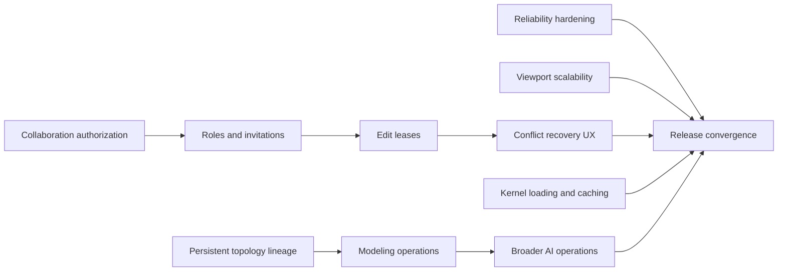

# OpenZCAD Implementation Plan

Status: proposed for technical review
Scope: reliability, viewport scalability, persistent topology, modeling breadth,
collaboration, AI operations, and exact-kernel delivery
Execution model: one integrator plus up to three parallel implementation agents

## Objective

Complete the next OpenZCAD milestones without weakening the browser document
model, exact-geometry guarantees, package boundaries, offline behavior, or
fail-closed topology handling.

The program should extend current capabilities rather than reimplement them.
Several roadmap items already have working foundations:

- Cloud settings use debounced local-first account autosave.
- The orientation cube supports face snapping and pointer-drag orbiting.
- Schema v4 includes face-attached sketch plane references.
- Multi-profile extrusion is implemented.
- Planar face offsets work through BrepKit and OpenCascade.
- BrepKit supports cylindrical hole and boss radius edits.
- Imported complete through-holes support recognition, resize, and removal.
- ADR-011 cross-kernel fingerprints are implemented and fail closed.
- Collaboration rooms already provide presence, history, merge/conflict
  detection, and persisted snapshots.
- The Durable Object has preliminary lock storage, but it is not an enforced
  product protocol.

## Non-negotiable constraints

- The canonical `ProjectDocument` and command history remain the source of
  truth.
- Geometry evaluation stays inside browser workers.
- Viewport code never mutates document or kernel state.
- Exact edits may not be authorized by tessellated or mesh-derived
  measurements.
- Ambiguous, stale, invalid, or unsupported topology fails visibly without
  modifying the document.
- Existing schema-v4 documents and serialized commands remain readable.
- Units and tolerances must be explicit and scale-aware.
- Collaboration permissions must be enforced server-side, not only through
  disabled UI controls.
- AI proposals must use the same deterministic command, preview, validation,
  and permission paths as manual edits.
- No production deployment target or production domain configuration is part
  of this program.

## Dependency graph

Persistent topology lineage is the critical path for modeling and AI.
Viewport, collaboration, reliability, and kernel-delivery work can proceed
alongside it.

## Parallel-agent operating model

There are four total execution slots:

1. **Integrator**
   - Owns shared contracts, schema versions, migrations, `App.tsx`, integration
     tests, commits, and pushes.
   - Reviews every public document/API change.
   - Resolves shared-file integration after each wave.

2. **Implementation Agent A**
3. **Implementation Agent B**
4. **Implementation Agent C**

Agent assignments change by wave. Every task must include:

- an explicit file allowlist;
- required targeted tests;
- acceptance criteria;
- prohibited shared files;
- the base commit being reviewed.

Agents do not commit independently. The integrator reviews their changes,
runs the wave gate, and creates scoped commits on the current branch. No two
active agents may edit `apps/web/src/App.tsx`,
`packages/kernel-adapter/src/exact.ts`, or shared schema contracts
simultaneously.

## Wave 0: Baselines and immediate hardening

### Integrator

- Record current performance, draw-call, bundle, and kernel fixture baselines.
- Create a current capability/gap matrix and update stale roadmap language.
- Approve the topology-lineage ADR direction before schema implementation.
- Freeze shared semantics for mirror, shell, solid offset, roles, and leases.

### Agent A: Cloud settings reliability

Likely ownership:

- new `apps/web/src/lib/cloudSettingsAutosave.ts`
- focused autosave unit tests
- assigned sections of `test/e2e/openzcad.spec.ts`

Work:

- Extract the account-save state machine from `App.tsx`.
- Coalesce rapid edits while preserving the newest local snapshot.
- Serialize requests and use each response revision for the next request.
- Retry after HTTP 409 by fetching the latest account revision once.
- Pause bounded retry while offline and resume after the `online` event.
- Flush before logout and ignore responses belonging to an old session.
- Preserve unsynced local state through failure and reload.

Acceptance:

- Ten rapid edits produce one final PATCH.
- An edit made during a PATCH produces one subsequent PATCH.
- A 409 performs GET plus one revision-safe retry.
- An outage never loses the device copy.
- Reconnection retries without requiring a new edit.
- Logout does not silently discard a pending change.
- No stale success status or unhandled promise rejection occurs.

### Agent B: Orientation cube reliability

Likely ownership:

- `apps/web/src/components/OrientationWidget.tsx`
- `packages/viewport/src/camera/CameraController.ts`
- `apps/web/src/styles/components/viewport-overlays.css`
- focused component/E2E tests

Work:

- Handle pointer cancellation, lost capture, blur, and unmount.
- Verify cleanup and damping completion.
- Cover mouse, touch, and pen input.
- Cover perspective, orthographic, desktop, and compact viewports.
- Retain keyboard face activation.

Acceptance:

- Movement below the drag threshold performs exactly one face snap.
- Movement above the threshold orbits and suppresses face snapping.
- Cancellation cannot leave a stuck drag.
- Projection mode, target, and finite camera distance are preserved.
- The interaction never scrolls the page or logs an error.

### Agent C: Topology-lineage spike

Likely ownership:

- new ADR under `docs/adrs`
- experimental tests or an isolated topology-lineage module

Work:

- Prove available generated/modified/deleted topology history in both pinned
  kernels.
- Test representative primitive, sweep, transform, boolean, fillet, and
  chamfer edits.
- Identify where BrepKit requires a bridge extension.
- Propose an additive schema-v5 reference contract.

### Wave 0 gate

- Reliability tests pass.
- Current baselines are recorded.
- The topology-lineage spike demonstrates a safe implementation path or
  clearly identifies the required kernel bridge.
- Product decisions listed under “Review decisions” are approved.

## Wave 1: Independent foundations

### Agent A: Viewport edge consolidation

Primary ownership:

- `packages/viewport/src/render/scene.ts`
- new `packages/viewport/src/render/edgeOverlay.ts`
- `packages/viewport/src/pick/PickService.ts`
- `packages/viewport/src/selection/SelectionManager.ts`
- viewport tests

Work:

- Convert each body's renderable edge polylines into one idle-edge batch.
- Maintain segment-index to `{bodyId, topologyId, hash}` ownership.
- Keep hover and selected edges in small reusable overlay batches.
- Preserve body-scoped visibility and seam filtering.
- Change selection visuals without rebuilding body geometry.

The integrator owns the final `ModelViewer.tsx` effect split:

- geometry effect keyed by bodies;
- selection effect keyed by selected topology.

Acceptance:

- Idle edge rendering uses at most one draw call per visible body.
- Selection changes do not dispose body geometry, recreate materials, refit the
  camera, or invalidate the shadow map.
- Edge/face picking, depth cycling, box selection, snapping, hidden bodies,
  wireframe, hover, and multi-edge selection remain correct.
- Performance probes show a material draw-call reduction from the current
  approximately 132-call Heat Sink baseline with no p95 frame-time regression.

### Agent B: Collaboration authorization

Primary ownership:

- new migration `apps/web/migrations/0008_project_sharing.sql`
- persistence authorization helpers
- Worker authorization tests

Proposed data:

- `project_members`
- `project_invitations`
- `project_access_events`
- nullable revision `author_user_id`

Roles:

- `owner`
- `editor`
- `viewer`

Work:

- Keep `projects.user_id` and `ProjectDocument.ownerUserId` authoritative and
  immutable.
- Add centralized `requireProjectRead`, `requireProjectEdit`, and
  `requireProjectOwner` checks.
- Apply them to project, revision, artifact, upload, collaboration, and sharing
  routes.
- Preserve `404` behavior for unauthorized resources.

Acceptance:

- Existing owners retain identical behavior.
- Viewers fail every mutation when bypassing the UI.
- Editors can save without changing document ownership.
- Unrelated projects remain undiscoverable.

### Agent C: Additive topology contracts

Primary ownership after ADR approval:

- new `packages/kernel-adapter/src/topology-lineage.ts`
- topology contract tests

Integrator-owned shared changes:

- `packages/shared/src/index.ts`
- `packages/document-core/src/index.ts`
- `packages/command-system/src/index.ts`
- migrations and replay compatibility

New topology references should include:

- topology kind;
- producing feature identity;
- stable lineage name;
- current ADR-011 hash;
- exact geometric witness used for fail-closed validation.

Resolution order:

1. unique compatible lineage;
2. unique ADR-011 hash for legacy references;
3. visible failure.

Nearest-geometry matching, traversal order, and silent rebinding remain
forbidden.

### Wave 1 gate

- Schema-v4 projects replay unchanged.
- New lineage references serialize, undo, redo, and collaborate correctly.
- Existing authorization behavior passes parity tests.
- Viewport batching meets its correctness and performance targets.

## Wave 2: Lineage, roles, leases, and worker lifecycle

### Agent A: BrepKit lineage propagation

- Primitive semantic faces and edges.
- Extrude/revolve caps and source-profile sides.
- Transform one-to-one inheritance.
- Boolean, fillet, chamfer, pattern, and direct-edit propagation.
- Explicit split/merge/delete ambiguity diagnostics.

### Agent B: OpenCascade lineage propagation

- Equivalent semantic identity and propagation.
- Cross-kernel parity with BrepKit.
- STEP boundaries remain hash-only unless reliable feature provenance exists.
- Cross-kernel rerouting must preserve lineage or fail closed.

### Agent C: Invitations, roles, and project lease

Additive APIs proposed for review:

- `GET /api/projects/:id/sharing`
- `POST /api/projects/:id/invitations`
- `DELETE /api/projects/:id/invitations/:inviteId`
- `PATCH /api/projects/:id/members/:userId`
- `DELETE /api/projects/:id/members/:userId`
- `POST /api/project-invitations/accept`

Invitation requirements:

- 256-bit opaque token; only its hash is persisted.
- Authenticated email must match the normalized invitation email.
- Seven-day, single-use beta default.
- Conditional SQL prevents simultaneous acceptance/revocation.
- Rate limits and active member/invitation caps.
- Token and unnecessary email values never enter logs.

Edit lease protocol:

- Project-wide exclusive lease for owner/editor.
- Typed acquire, renew, release, grant, deny, and lost messages.
- Document and oversized snapshot writes require the active lease.
- Lease is bound to project, client, user, and expiry.
- Lease is persisted before broadcast.
- Downgrade/removal revokes the lease immediately.
- Viewers receive room updates but never author room state.

### Integrator: Worker lifecycle and request ordering

Add typed worker states:

- `starting`
- `loading-brepkit`
- `loading-occt`
- `rebuilding`
- `ready`
- `failed`

Also:

- serialize exact worker jobs;
- coalesce superseded broadcast rebuilds;
- preserve explicit export and `syncOnce` promises;
- tag state with project/version/request IDs;
- retain the last valid projection while marking it stale;
- disable topology-dependent actions until matching exact state arrives.

### Wave 2 gate

- References survive upstream dimension edits and kernel reroutes when
  unambiguous.
- Deleted, split, or merged topology fails visibly.
- Exactly one editor can hold the project lease.
- Forged, expired, cross-project, or other-client leases cannot write.
- Viewer mutations fail server-side.
- Worker UI never claims stale geometry is ready.

## Wave 3: Exact modeling operations

Before parallel work, extract narrowly scoped kernel-operation modules where
required so agents do not collide in `exact.ts`.

### Agent A: BrepKit mirror, shell, and solid offset

Use the pinned kernel's exact mirror, shell, and `offsetSolidV2` APIs.

Validation:

- finite, normalized mirror plane;
- explicit original-plus-copy semantics without automatic fusion;
- positive shell thickness;
- shared positive-outward offset sign;
- unique opening-face references;
- nonempty, closed, valid solid;
- finite bounds and volume;
- refusal on self-intersection or impossible thickness.

### Agent B: OpenCascade feature parity

- Mirror, shell, and uniform offset with identical adapter semantics.
- Generalized cylindrical resize for imported:
  - through holes;
  - blind holes;
  - bosses;
  - bounded axial spans.
- Verify analytic-cylinder result after replacement booleans.

### Agent C: Imported feature recognition

Recommended new module:

- `packages/kernel-adapter/src/imported-feature-recognition.ts`

Build an exact face-adjacency graph and initially recognize only:

1. blind cylindrical holes;
2. counterbores and countersinks;
3. cylindrical bosses;
4. prismatic pockets with depth editing;
5. conical tapers with one documented invariant.

Return unsupported for blends, ribs, intersecting features, ambiguous twins,
partial revolutions, or incomplete proof.

### Integrator: Document and command contracts

Add first-class feature/operation contracts for:

- mirror;
- shell;
- uniform solid offset;
- recognized coordinated imported edits.

Freeze:

- body consumption and result ownership;
- parameter fields and expressions;
- sign conventions;
- selection requirements;
- taper invariant;
- replay and migration semantics.

### Wave 3 gate

Every operation passes:

- create, edit, undo, redo, delete, reload, and replay;
- BrepKit/OCCT conformance within scale-aware tolerances;
- valid STEP export and reimport;
- mm, cm, m, and inch coverage;
- transformed and rotated part fixtures;
- stale/ambiguous topology refusal;
- no document/history mutation after failed preflight.

## Wave 4: Product UI, true face attachment, and conflict recovery

### Agent A: True face-attached sketches

- Resolve the planar source face at the sketch's history position.
- Rebuild its frame from evolved face center/normal and a deterministic
  in-plane axis.
- Follow valid transforms and dimensional changes.
- Retain the frame snapshot for migration and diagnostics.
- Fail with the sketch and source feature named when the face disappears,
  becomes nonplanar, or is ambiguous.

### Agent B: Modeling UI components

Ownership excludes `App.tsx`:

- feature forms;
- inspector sections;
- topology labels;
- interaction capability/state modules;
- tool definitions;
- focused component tests.

UI:

- mirror, shell, and offset operations;
- opening-face selection;
- recognized imported-feature labels;
- coordinated editable dimensions;
- exact preflight and expression-valued numeric entry;
- explicit unsupported explanations.

### Agent C: Collaboration UI components

Ownership excludes `App.tsx`:

- API client additions;
- share dialog;
- member and invitation components;
- role indicators;
- lease state;
- conflict dialog;
- `useCollaboration` protocol extensions.

Conflict actions:

- **Use room version**
- **Keep my version**
- **Save local as a copy**

All destructive resolutions first preserve the divergent local document in
IndexedDB. “Keep mine” requires an active lease and expected room version.

### Integrator

- Wire all component APIs into `App.tsx`.
- Add central `canEdit` enforcement around command execution, checkpointing,
  uploads, imports, and AI Apply.
- Ensure role changes revoke active capabilities immediately.

### Wave 4 gate

- Face attachments follow valid source topology and never attach to a nearby
  face.
- Modeling forms and direct manipulation use identical exact preflight.
- A conflict cannot enter an autosend loop.
- Reloading or closing conflict UI cannot destroy the local divergent copy.
- Viewers cannot acquire leases or choose “Keep my version.”

## Wave 5: AI expansion, caching, and convergence

### Agent A: AI operation contracts

Add operations individually in this order:

1. existing deterministic direct edits;
2. face-attached sketches;
3. multi-profile extrudes;
4. mirror;
5. shell and solid offset;
6. recognized imported features after diagnostics mature.

Each operation requires:

- stable document contract;
- deterministic command factory;
- preassigned IDs and alias resolution;
- replay and undo/redo;
- exact fail-closed validation;
- complete digest context;
- equivalent JSON schema and runtime validator;
- identical preview and Apply preflight;
- readable proposal summary;
- stale document/topology rejection.

AI may never invent topology hashes, infer an unselected face, bypass the
project lease, or partially apply an invalid operation.

### Agent B: Kernel loading and caching

- Keep worker bootstrap small.
- Load BrepKit only when exact geometry is required.
- Load OpenCascade only for STEP work.
- Add bounded in-flight/result caching keyed by canonical content excluding
  `derived`.
- Verify immutable caching for hashed WASM/static assets in beta.
- Do not add a service worker solely for caching.
- Spike BrepKit feature-prefix caching only after lineage stabilizes.
- Keep OpenCascade on result caching until retained-handle lifetime is proven
  safe.

### Agent C: Release QA and documentation

- Schema migration and replay matrix.
- Cross-kernel fixtures.
- Collaboration authorization and lease attacks.
- AI contract/schema parity.
- Browser accessibility and responsive flows.
- Performance and bundle reports.
- Updated ADRs, README, TODO, and performance baseline.

### Wave 5 gate

- All enabled AI operations satisfy the deterministic readiness checklist.
- Empty projects avoid unnecessary kernel loading.
- OpenCascade is not fetched until STEP work.
- Identical concurrent rebuilds execute once.
- Rapid rebuilds publish only the newest result.
- Worker termination rejects every outstanding promise.
- Cache and memory use remain bounded.

## Global verification gate

Every wave:

- `pnpm typecheck`
- scoped lint for touched paths
- targeted package/unit tests
- `git diff --check`

Integration waves additionally:

- full repository tests, leaving documented pre-existing failures alone;
- exact-kernel and cross-kernel seam suites;
- document migration, replay, undo/redo, and collaboration suites;
- focused Playwright flows;
- production build and chunk report;
- browser QA at desktop and compact breakpoints;
- performance probes on the same reference hardware.

## Rollout controls

Use non-production flags:

- `PROJECT_SHARING_ENABLED`
- `PROJECT_EDIT_LEASES_ENFORCED`
- `AI_PATCH_DIRECT_EDIT_ENABLED`
- per-operation AI flags where appropriate

Rollout order:

1. Apply sharing migration dark.
2. Route existing owners through the new authorization resolver.
3. Enable viewer sharing internally.
4. Enable editor sharing only with lease enforcement.
5. Enable conflict recovery after recovery-copy tests.
6. Enable modeling operations individually after exact-kernel gates.
7. Enable each AI operation independently after manual-path readiness.

## Review decisions

The reviewing agent should explicitly approve or revise:

1. **Schema v5 topology reference**
   - Recommended: additive lineage plus existing hash/witness fallback.

2. **Face attachment**
   - Recommended: evolved face is authoritative while resolvable; stored frame
     is migration/diagnostic data, not a silent permanent fallback.

3. **Mirror result**
   - Recommended: original plus mirrored copy, with no automatic fusion.

4. **Shell and offset signs**
   - Recommended: positive shell thickness; positive solid offset is outward.

5. **Taper invariant**
   - Choose one authoritative editable parameter, such as angle or end
     diameter, while fixing a documented neutral plane.

6. **Collaboration lock granularity**
   - Recommended: one project-wide edit lease until command/resource-level
     server validation exists.

7. **Roles**
   - Recommended: immutable owner, editor, viewer; no ownership transfer in
     this milestone.

8. **Invitation defaults**
   - Recommended: seven-day, single-use, matching authenticated email.

9. **Conflict behavior**
   - Recommended: local recovery copy before every destructive resolution.

## Reviewer checklist

- Are any ownership ranges likely to collide between parallel agents?
- Does any proposed operation weaken browser document/history authority?
- Can every new topology reference fail closed without nearest-shape guessing?
- Are schema and command migrations additive and replay-safe?
- Are units, tolerances, sign conventions, and body-consumption rules explicit?
- Are unsupported imported features labeled instead of inferred?
- Are sharing permissions enforced consistently across every route and socket?
- Are leases sufficient for the current snapshot protocol?
- Can conflict handling or account switching lose local work?
- Does every AI operation use an already-proven manual command path?
- Are performance targets measurable on the existing probes?
- Are all public APIs, schema changes, and kernel bridge changes called out for
  explicit review?

## Principal risks

- Boolean/generated-shape lineage may require a new BrepKit bridge API.
- Schema v5 changes the public project-file format.
- True face attachment changes current snapshot-based behavior.
- Shell and offset may self-intersect below local feature size; refusal is safer
  than healing or approximation.
- Closed B-spline/NURBS topology remains outside cross-kernel identity
  guarantees and must continue to fail closed.
- Imported multi-face recognition can become combinatorial unless bounded by
  an adjacency graph and narrowly proven feature families.
- Role or lease mistakes could expose or overwrite shared project data.
- AI exposure before deterministic command maturity could bypass modeling
  assumptions or create unreplayable history.
