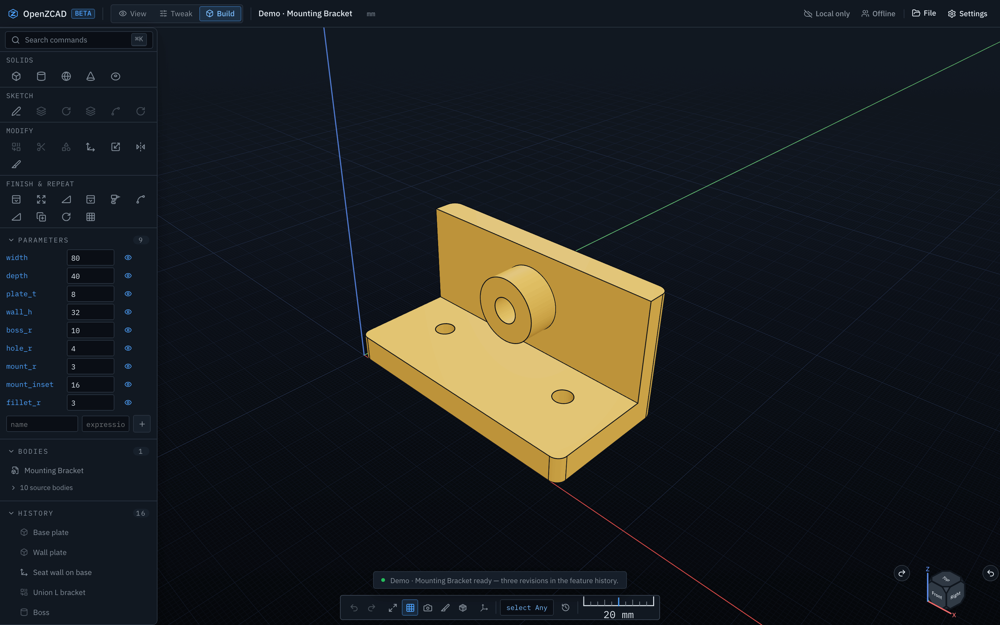
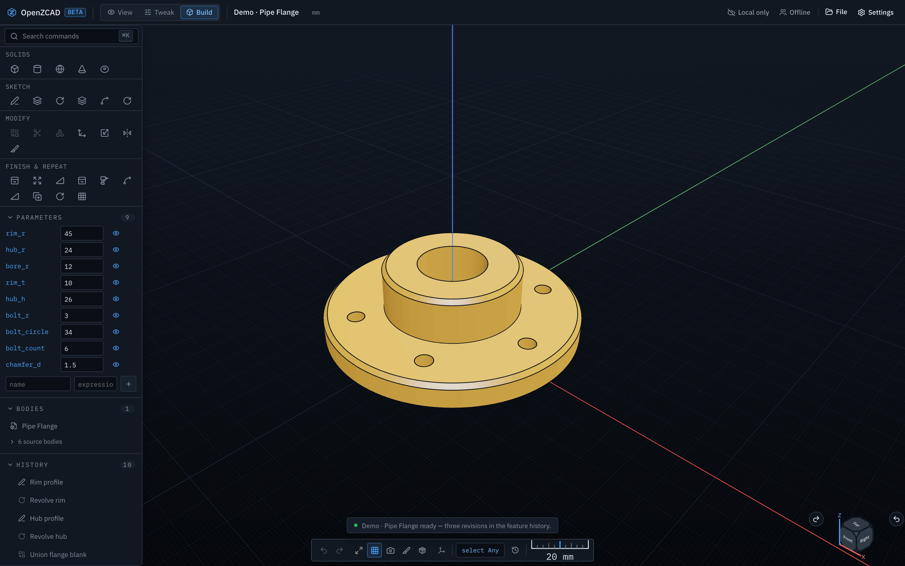
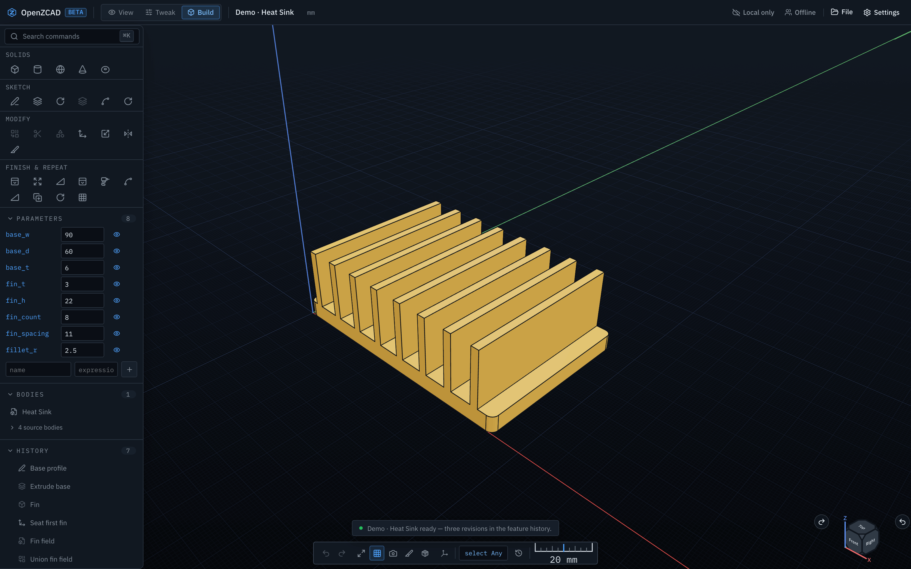

# OpenZCAD

OpenZCAD is a browser-first parametric CAD workspace: exact B-rep solid modeling, a replayable feature history, and direct on-model manipulation, with no desktop install. The canonical project document stores named parameters, sketches, and an ordered command history, and a WebAssembly solid kernel rebuilds exact geometry in a background worker.



## Highlights

**Exact parametric modeling.** Primitives, sketch/extrude, revolve, booleans, transforms, fillet, chamfer, and linear/circular patterns, built on the [BrepKit](https://github.com/esaueng/brepkit) exact kernel. Parametric expressions, ordered feature history with editing and deletion, deterministic replay, transactions, and undo/redo.

**Direct manipulation.** Shapr3D-style modeling straight on the model: drag a face to offset it, drag a sketch region into a solid, drag an edge to grow a fillet or chamfer, move/rotate bodies with a snapping gizmo — every drag pairs with exact numeric entry. In-viewport sketching with snapping and live dimensions, box select, selection filters, a marking menu, an Esc ladder, and a live orientation widget with perspective/orthographic switching.

**Two kernels, one topology language.** BrepKit is the primary kernel; documents containing STEP imports rebuild through OCCT. Both kernels persist the same geometric topology fingerprints ([ADR-011](docs/adrs/ADR-011-unified-topology-identity.md)), so fillets, chamfers, and direct edits survive kernel reroutes and upstream edits — and fail closed with a diagnostic instead of silently landing on different geometry.

**Import and export.** Editable STEP import stored in replayable document history: selecting an exact imported face shows its surface type and area, complete through-holes expose a parametrically editable diameter, and validated face features can be removed. STEP export preserves distinct solids as a compound; STL export is always millimetres. STL imports become mesh bodies. All geometry and exports run in the browser worker.

**Local-first, optionally cloud.** IndexedDB autosave works with no account; when local and cloud copies diverge, the newer version wins instead of discarding work. Optional passwordless profiles (single-use email codes, opaque D1-backed sessions) unlock cloud projects, synced settings, and live per-project collaboration over a Durable Object WebSocket room with presence, version-aware sync, and conflict preservation.

<p align="center">
  
  
</p>

## Quick start

Requires Node.js 20.19+ on the 20.x line, or Node.js 22.12+, and pnpm 10.

```bash
pnpm install
cp apps/web/.dev.vars.example apps/web/.dev.vars
pnpm dev:web
```

Open the URL Vite prints. Three built-in demos (Mounting Bracket, Pipe Flange, Heat Sink) are available from the start screen.

Settings are available from the start screen, the workspace gear, the command palette, or `Ctrl/Cmd+,` — the Settings page overlays the workspace, so any in-flight work survives it.

## Architecture

```text
React workspace (apps/web)
  ├─ canonical ProjectDocument + CommandManager   (source of truth)
  ├─ IndexedDB autosave
  ├─ Three.js viewport                            (disposable projection)
  └─ geometry Web Worker
       ├─ brepkit-wasm  — primary exact B-rep kernel
       └─ occt-wasm     — STEP import/export; documents with STEP
                          features rebuild through OCCT

Cloudflare Worker (beta orchestration only)
  ├─ D1 project metadata, documents, sessions, settings
  ├─ R2 artifact coordination
  ├─ Email-code identity + owner authorization (optional)
  ├─ Durable Object live project rooms
  └─ AI assistant proposal stream (optional, experimental)
```

Boundaries that hold everywhere:

- The browser document/history model is the source of truth; meshes are disposable projections.
- Geometry and exports run in the browser worker, never in the Cloudflare Worker.
- Both kernels persist identical topology fingerprints; resolution is fail-closed at every call site. Documents saved by the pre-fingerprint OCCT scheme are rejected with a re-select diagnostic rather than reinterpreted.
- Schema-v1/v2 documents migrate to v3 on load.

See [architecture.md](architecture.md) and the decision records in [docs/adrs](docs/adrs).

The monorepo is a pnpm workspace: `apps/web` plus focused packages — `document-core` (canonical model), `command-system` (undo/redo, transactions), `geometry` (sketch regions, plane math), `kernel-adapter` (BrepKit + OCCT behind one interface), `viewport` (React-free three.js scene framework), `io-step`/`io-stl`, `ai-contracts`, `cloudflare-adapters`, `persistence`, and `shared`.

## Development

```bash
pnpm dev:web          # Vite + local Cloudflare Worker
pnpm typecheck        # TypeScript
pnpm lint             # ESLint
pnpm test             # unit and integration tests (Vitest)
pnpm test:web         # web app tests
pnpm test:e2e         # Playwright end-to-end suite
pnpm test:coverage    # unit tests with coverage
pnpm build            # production web/worker bundle
pnpm deploy:beta      # beta-only Cloudflare deployment
```

Local development uses `AUTH_MODE=development` and the isolated `user_beta_dev` identity. Never deploy `apps/web/wrangler.jsonc`: it is a development-only config and deliberately binds a placeholder dev database ID so it cannot write to beta data (create a real dev D1 and replace the ID for local use). The worker refuses to start if development authentication is combined with a guarded or non-development environment. When R2/Durable Object bindings are absent, the affected routes return a clean `FEATURE_DISABLED` 501 before touching persistence.

### Performance

Interaction and startup performance are measured, not guessed — see [docs/performance-baseline.md](docs/performance-baseline.md) for the committed baselines and history. Rendering is on demand: hover picking is coalesced to one raycast per frame and skipped during camera drags, and the shadow map only re-renders when geometry changes. Reproduce the interaction numbers with:

```bash
OZ_PERF=1 pnpm exec playwright test interaction-probe
```

The BrepKit WASM bundle is ~4.7 MB (~1.7 MB gzip) and loads in the geometry worker, not the UI thread; OCCT (~22 MB) loads lazily and only for STEP work. BrepKit is consumed from the `esaueng/brepkit` fork's `main` branch (exact commit pinned in the lockfile), not from npm.

## Beta deployment

Email sign-in uses Cloudflare Email Service and Turnstile. Before enabling a real beta login:

- onboard the `auth.esau.app` sending domain and keep the `EMAIL` binding restricted to `login@auth.esau.app`;
- create a managed Turnstile widget allowlisting `zcad.esau.app` and bind its site key as `TURNSTILE_SITE_KEY`;
- deploy with `pnpm deploy:beta`, which applies the remote D1 migrations before publishing the Worker;
- set `AUTH_MODE=email-code`, `ENVIRONMENT=beta`, `AUTH_EMAIL_FROM=login@auth.esau.app` (the checked-in beta config also sets `PRODUCTION_GUARD`, which makes the worker refuse development auth outright);
- provide secrets, generated with `openssl rand -base64 32` where appropriate and set via `wrangler secret put`, never committed: `AUTH_OTP_PEPPER`, `TURNSTILE_SECRET_KEY`, `SETTINGS_ENCRYPTION_KEY` (must stay stable across deploys), `AI_IDENTITY_PEPPER`, `AI_DEPLOYMENT_ALLOWED_EMAILS`, and the AI provider key if the assistant is enabled. The required non-provider secrets are declared in `wrangler.jsonc`, so Wrangler rejects an incomplete deployment.

Login codes are single-use, expire after ten minutes, and sit behind per-email and per-IP rate limits. Sessions use a `Secure`, `HttpOnly`, `SameSite=Lax` host cookie; only a SHA-256 hash of the opaque token is stored. Turnstile responses must carry the `email-code` action, and every non-development verification pins the response hostname to the request hostname. `AUTH_LEGACY_OWNER_EMAIL` maps historical `user_beta_dev` projects to their owner's verified email without rewriting documents.

## API surface

```text
GET  /api/health                      GET       /api/assistant/status
GET  /api/auth/config                 POST      /api/assistant/proposals    (SSE)
POST /api/auth/email/start            GET|PATCH /api/settings
POST /api/auth/email/verify           PUT|DELETE /api/settings/assistant-credential
POST /api/auth/logout                 POST      /api/settings/assistant/test
GET  /api/session                     POST      /api/uploads
GET|POST /api/projects                PUT       /api/uploads/:id/content
GET  /api/projects/:id                POST      /api/artifacts/finalize
POST /api/projects/:id/revisions      GET       /api/projects/:id/artifacts
GET  /api/projects/:id/collaboration  (WebSocket upgrade)
POST /api/projects/:id/collaboration  (oversize snapshot recovery)
GET  /api/artifacts/:id               GET       /api/artifacts/:id/download
```

Cloud settings, personal credentials, projects, artifacts, and collaboration require an email-code session; the assistant also serves local-only users. Artifacts require an uploaded R2 object before finalization.

## AI assistant (experimental)

An optional side panel turns plain-language requests into reviewable document patches. It is experimental and entirely optional — the workspace is fully functional without it, and it stays dormant until a provider key is configured.

The assistant streams proposals through the OpenAI Responses API. It sees compact feature history, live exact-topology summaries, and the active selection, so "fillet all edges" resolves stable edge fingerprints without manual picking. Output is constrained to a strict CAD patch schema; you preview, apply, or reject, and apply is one normal undoable transaction. PDF and image drawings can be attached as references. The AI can only propose a small allowlisted command patch — it cannot directly mutate a document, viewport, or kernel.

OpenRouter is the default provider. For local development, export the key in the launching shell or set it in `apps/web/.dev.vars` (git-ignored):

```dotenv
AI_PROVIDER=openrouter
OPENROUTER_API_KEY=your_key_here
AI_MODEL=openai/gpt-5.6-terra
```

Runtime bindings are configured as Wrangler vars or secrets:

- `AI_PROVIDER` — `openrouter`, `openai`, or `responses-compatible`.
- `OPENROUTER_API_KEY` / `OPENAI_API_KEY` / `AI_API_KEY` — the server-side secret; never shipped to the browser or committed.
- `AI_BASE_URL` — optional endpoint override; required for `responses-compatible`.
- `AI_MODEL` — defaults to `openai/gpt-5.6-terra` (balanced). Use `openai/gpt-5.6-sol` when quality matters more than cost/latency, `openai/gpt-5.6-luna` for cheap latency-sensitive edits.
- `AI_REASONING_EFFORT` — `low`/`medium`/`high`/`xhigh`, default `high`.
- `AI_MAX_OUTPUT_TOKENS` — default `32000`; reasoning shares the budget, and too low a ceiling truncates patches mid-stream as a normal incomplete response.
- `AI_SITE_URL` / `AI_APP_NAME` — optional OpenRouter attribution.
- `AI_ALLOWED_BASE_URL_HOSTS` — exact, comma-separated hostnames approved for saved Responses-compatible endpoints outside development. Redirects are never followed.
- `AI_GLOBAL_DAILY_REQUEST_LIMIT` / `AI_GLOBAL_DAILY_COST_LIMIT_UNITS` — deployment-wide D1-backed ceilings; defaults are 100 requests and 400 weighted cost units per UTC day.
- `AI_DEPLOYMENT_ALLOWED_EMAILS` — secret, comma-separated email allowlist for accounts permitted to spend the deployment provider key. An empty or missing value denies deployment-funded AI outside development.

Signed-in users can instead store a personal provider token (Settings → AI). Tokens are encrypted with AES-GCM by the Worker (`SETTINGS_ENCRYPTION_KEY`) and never enter project documents or browser storage. `GET /api/assistant/status` never exposes provider secrets or deployment availability to a signed-out or non-allowlisted request. Public request identities and IP quota buckets use domain-separated HMAC-SHA-256 values keyed by `AI_IDENTITY_PEPPER`; the raw address is never stored or sent upstream.

Current assistant limitations:

- **Assistant usage is bounded before provider dispatch** — beta requests use an authenticated deployment-key allowlist, D1-backed global/account/opaque-IP request and token-weighted cost quotas, and expiring concurrency leases. Provider-side billing controls remain the final deployment spend cap.
- Proposals cannot yet create sketch entities, face-attached sketches, imported geometry, or collaboration actions.

## Known limitations

- Editable STEP sources are embedded in the canonical document (capped at 12 MB) for deterministic offline replay; large documents get expensive to save, sync, and undo (history snapshots clone the full document).
- Imported STL stays a mesh body on the compatibility path; no parametric reconstruction is attempted.
- Collaboration rooms store each document under its own Durable Object key (bounded history, atomic index updates, typed rejection frames for oversize or malformed payloads; documents over ~1.5 MB JSON are rejected). Invitations, viewer/editor roles, and edit locks remain future work.
- BrepKit's difficult boolean cases can fall back to mesh-derived topology, and closed-B-spline/NURBS-blend faces are not cross-kernel fingerprint-stable — they fail closed rather than mis-resolve.
- Viewport draw calls scale with topology edge count (one fat-line draw per edge); edge-overlay consolidation is the next planned rendering milestone.

## Next milestones

1. Viewport edge-overlay consolidation and selection updates without full scene rebuilds.
2. Sharing invitations, viewer/editor roles, and edit locks.
3. Imported-face dimension edits beyond through-holes (blind/counterbored holes, bosses, pockets, tapers); mirror, shell/offset, face-attached sketches.
4. Persistent naming resilient to upstream topology changes.
5. Broader AI patch operations as each feature gains a deterministic command contract.
6. Exact-kernel caching, loading UX, and finer worker bundle splitting.

## License

Apache License 2.0 — see [LICENSE](LICENSE). Copyright 2026 Esau Engineering LLC. See [THIRD-PARTY-NOTICES.md](THIRD-PARTY-NOTICES.md) for bundled dependency and font notices.
