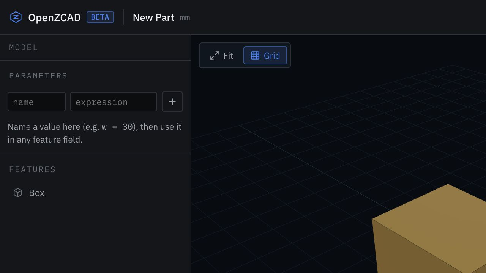

# OpenZCAD

OpenZCAD is a browser-first parametric CAD workspace for people who want to turn design intent into editable, exact solid models without installing a desktop CAD stack. The canonical project document stores named parameters, sketches, feature history, and replayable commands; an OpenCascade WebAssembly kernel rebuilds exact B-rep geometry in a browser worker; and an optional AI assistant translates plain-language changes into reviewable, previewable, undoable document patches.



## What works

- Exact OpenCascade geometry for primitives, sketch/extrude, revolve, transforms, booleans, fillet, chamfer, and linear/circular patterns.
- Parametric expressions, ordered feature history, editing, deletion, deterministic replay, transactions, and undo/redo.
- Editable STEP import stored in replayable document history, plus STEP and STL downloads generated by the same browser worker that rebuilds viewport geometry.
- A dense model/viewport/inspector workspace with exact face/edge selection, contextual finishing actions, measurements, diagnostics, and responsive compact states.
- Local-first IndexedDB autosave. When local and beta-cloud copies differ, OpenZCAD opens the newer document version instead of discarding local work.
- Cloudflare Access identity in beta, owner-scoped project/artifact routes, and a development-only local identity mode. `AUTH_LEGACY_OWNER_EMAIL` can map existing beta data to its original owner without rewriting documents.
- Live per-project collaboration over a Durable Object WebSocket room, with presence, version-aware document sync, and conflict preservation.
- Streamed AI proposals through the OpenAI Responses API. The assistant receives compact feature history plus the active topology selection and can propose parameter/dimension edits, primitives, sweeps, booleans, transforms, fillets/chamfers, and patterns. Output is constrained to a strict CAD patch schema; users preview, apply, or reject it. Apply creates one normal undoable transaction.
- Beta Worker endpoints for project persistence, revisions/checkpoints, upload coordination, artifact metadata, exports, and AI proposal streaming.

## Architecture

```text
React workspace
  ├─ canonical ProjectDocument + CommandManager
  ├─ IndexedDB autosave
  ├─ Three.js viewport (projection only)
  └─ geometry Web Worker
       └─ occt-wasm / OpenCascade exact B-rep

Cloudflare Worker (beta orchestration only)
  ├─ D1 project metadata and documents
  ├─ R2 artifact coordination
  ├─ Cloudflare Access identity + owner authorization
  ├─ Durable Object live project rooms
  └─ OpenAI Responses API stream → strict CadPatchProposal
```

Important boundaries:

- The browser document/history model is the source of truth. Meshes are disposable projections.
- Geometry and exports run in the browser worker, never in the Cloudflare Worker.
- AI can propose a small allowlisted command patch. It cannot directly mutate a document, viewport, or kernel.
- Saves/checkpoints are separate from model-edit revisions. Schema-v1 documents migrate to schema v2 on load and existing owner data can be mapped by email.

See [architecture.md](architecture.md) and the decisions in [docs/adrs](docs/adrs).

## Local setup

Requirements: Node.js 20+ and pnpm 10.

```bash
pnpm install
cp apps/web/.dev.vars.example apps/web/.dev.vars
pnpm dev:web
```

Open the local URL printed by Vite. The CAD workspace works without an AI key; the assistant displays a clear configuration message until one is provided.

Local development uses `AUTH_MODE=development` and the isolated `user_beta_dev` identity. Beta deployment uses `AUTH_MODE=cloudflare-access` and must sit behind a Cloudflare Access policy. Set `AUTH_LEGACY_OWNER_EMAIL` as a Worker secret or variable to the Access email that should inherit historical `user_beta_dev` projects.

OpenRouter is the default AI provider. Configure secrets only in `apps/web/.dev.vars` or with `wrangler secret`:

```dotenv
AI_PROVIDER=openrouter
OPENROUTER_API_KEY=your_key_here
AI_MODEL=openai/gpt-5.6-terra
```

For local development, copy the example, set the key, and restart `pnpm dev:web`:

```bash
cp apps/web/.dev.vars.example apps/web/.dev.vars
```

For the beta Worker, store the key as a Cloudflare secret instead of a file:

```bash
pnpm --filter @openzcad/web exec wrangler secret put OPENROUTER_API_KEY --env beta
```

The assistant checks `GET /api/assistant/status` on startup and reports the configured model/reasoning tier without exposing the secret. `.dev.vars` files are ignored by Git.

The recommended default is `openai/gpt-5.6-terra`: it is the balanced GPT-5.6 tier for reliable structured CAD planning. Use `openai/gpt-5.6-sol` when maximum quality matters more than cost/latency, or `openai/gpt-5.6-luna` for inexpensive, latency-sensitive edits.

Direct OpenAI and other Responses-compatible providers remain supported. Non-secret settings live in `wrangler.jsonc`:

- `AI_PROVIDER` accepts `openrouter`, `openai`, or `responses-compatible` and defaults to OpenRouter in the checked-in app config.
- `OPENROUTER_API_KEY`, `OPENAI_API_KEY`, or provider-neutral `AI_API_KEY` supplies the server-side secret.
- `AI_BASE_URL` optionally overrides the provider endpoint and is required for `responses-compatible`.
- `AI_MODEL` defaults to `openai/gpt-5.6-terra` for OpenRouter and `gpt-5.6-sol` for direct OpenAI when no app config overrides it.
- `AI_REASONING_EFFORT` defaults to `high` and accepts `low`, `medium`, `high`, or `xhigh`.
- `AI_MAX_OUTPUT_TOKENS` defaults to `32000`. Reasoning tokens share this budget, and a multi-part model runs to roughly 20 operations; too low a ceiling truncates the patch mid-stream, which the provider reports as a normal incomplete response rather than an error. Lower it only if your model caps output below the default.
- `AI_SITE_URL` and `AI_APP_NAME` optionally send OpenRouter attribution headers.

All provider/model choices are centralized; no API key is shipped to the browser or committed.

## Commands

```bash
pnpm dev:web      # Vite + local Cloudflare Worker
pnpm typecheck    # TypeScript
pnpm lint         # ESLint
pnpm test         # unit and integration tests
pnpm build        # production web/worker bundle
pnpm deploy:beta  # beta-only Cloudflare deployment
```

The exact-kernel WASM bundle is about 22 MB uncompressed (about 7 MB gzip). It is loaded in the geometry worker, not the main UI thread.

## API surface

- `GET /api/health`
- `GET /api/session`
- `GET /api/assistant/status`
- `GET|POST /api/projects`
- `GET /api/projects/:id`
- `POST /api/projects/:id/revisions`
- `GET /api/projects/:id/collaboration` (WebSocket upgrade)
- `POST /api/uploads`
- `POST /api/imports/finalize`
- `POST /api/exports`
- `GET /api/artifacts/:id`
- `POST /api/assistant/proposals` (SSE)

Existing project, revision, upload, import, export, and artifact route shapes were preserved. Session and collaboration routes are additive; existing data remains schema compatible.

## Beta limitations and risks

- The beta route must be protected by Cloudflare Access. Local development identity mode is intentionally unsuitable for a public deployment.
- D1/R2 IDs in the checked-in Wrangler configuration are beta placeholders until real beta resources are provisioned.
- Editable STEP sources are embedded in the canonical document for deterministic offline replay and capped at 12 MB. This preserves editability but can make large documents expensive to save and sync.
- Imported STL remains a mesh body and uses the compatibility path; native parametric reconstruction is not attempted.
- Topology references use deterministic sub-shape ordinals. They survive an unchanged rebuild, but upstream geometry edits can reorder faces or edges and invalidate a downstream finishing feature with a visible diagnostic.
- Live rooms synchronize canonical documents and presence, but do not yet provide invitations, roles, edit locks, or durable room history. Snapshots above 900 KB continue to save locally/cloud-side but are not broadcast live.
- AI proposals cannot yet create sketch entities, face-attached sketches, imported geometry, or collaboration actions. They also cannot reference the generated body ID of an earlier operation in the same proposal, so multi-stage requests may require previewing and applying more than one patch.
- Exactness-first geometry adds a meaningful initial worker download. Service-worker caching and finer code splitting are future performance milestones.

## Next milestones

1. Sharing invitations, viewer/editor roles, locks, and durable collaboration history.
2. Mirror, shell/offset, face-attached sketches, holes/pockets, and richer STEP assembly manifests.
3. Persistent naming resilient to upstream topology changes.
4. Broader AI patch operations as each feature receives a deterministic command contract.
5. Exact-kernel caching, loading UX, and finer worker bundle splitting.
