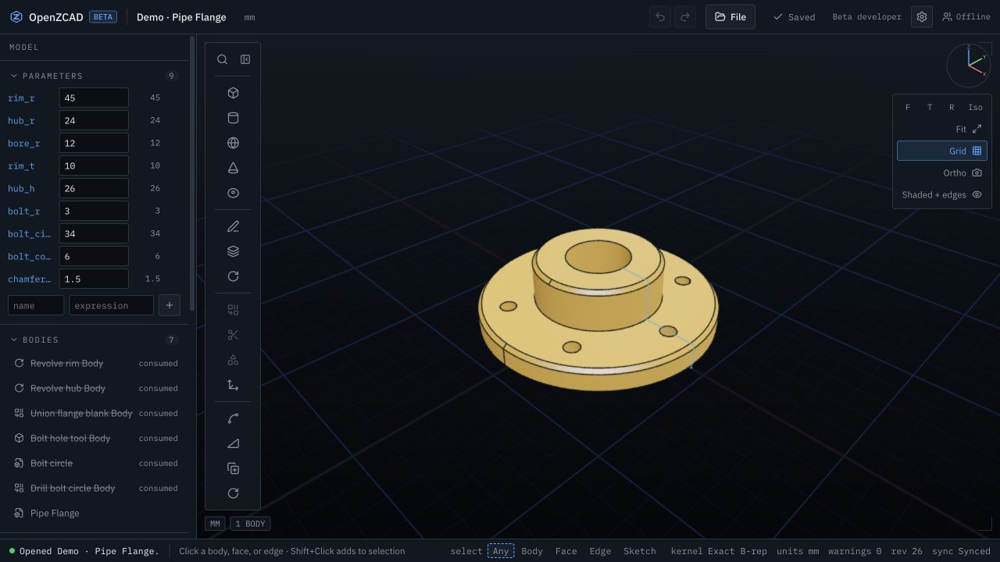
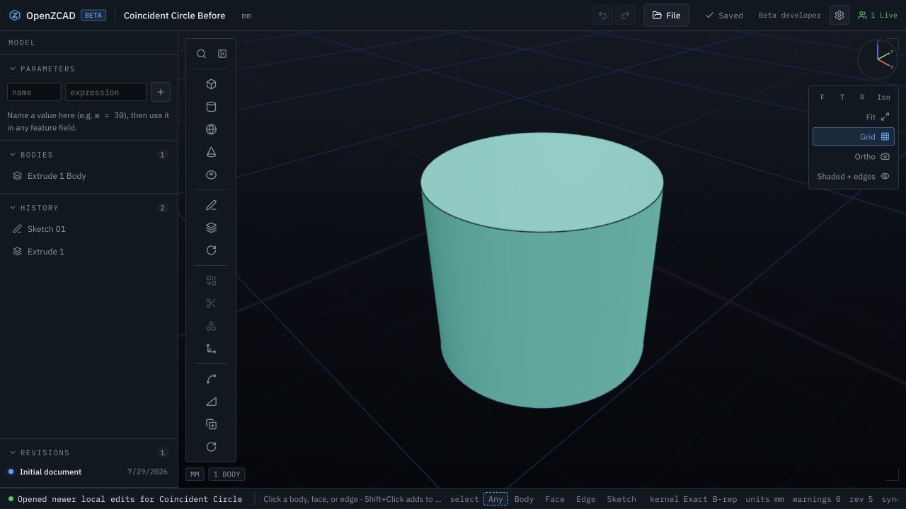
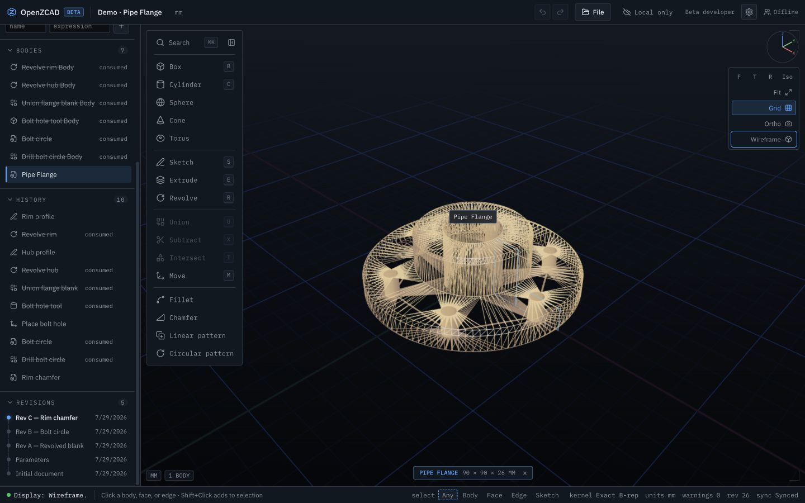
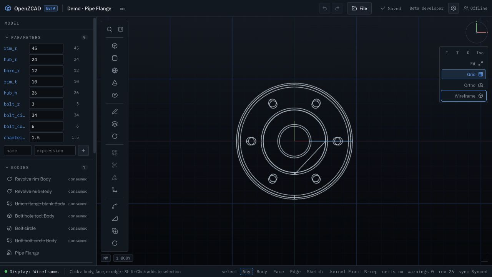
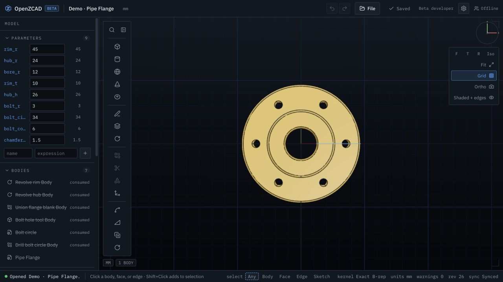
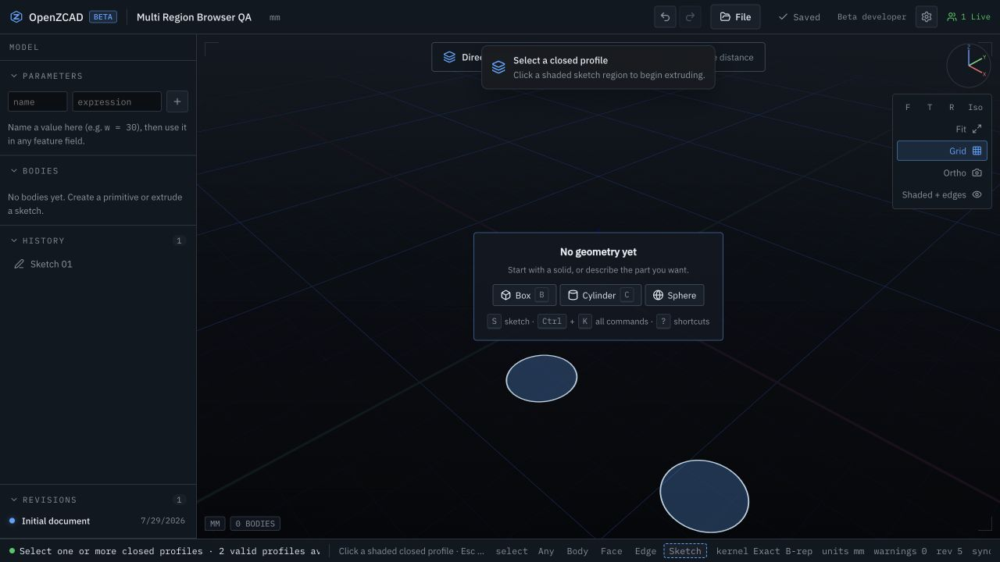
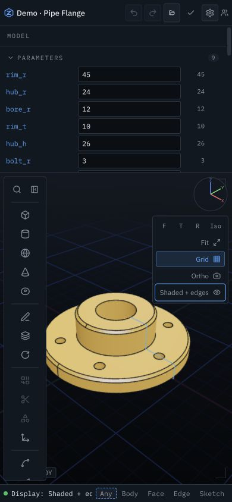

# CAD UI quality audit — 2026-07-29

## Scope

Browser-driven audit of the OpenZCAD workspace using deterministic sketch,
primitive, multi-profile extrusion, Pipe Flange, Mounting Bracket, and Heat
Sink models. The pass covered viewport rendering, selection, direct
manipulation, sketching, history editing, display/camera modes, responsive
layout, exact STEP export, undo/redo, and interaction performance.

No document schema, units, tolerance, public API, exact B-rep, STEP, STL, or
OBJ behavior changed. The fixes are limited to presentation, selection
rendering policy, status feedback, and regression instrumentation.

## Issue log

| ID | Severity | Reproduction | Root cause | Resolution | Regression |
| --- | --- | --- | --- | --- | --- |
| UI-01 | High | Draw a circle, extrude it, and view the retained sketch on the coincident body rim. The curve shimmered or thickened as the camera moved. | Body faces, exact edges, sketch curves, and duplicated region boundaries had no explicit depth/render hierarchy. Line overlays also wrote depth. | Added a single viewport render-order policy, offset body faces, disabled depth writes for fat lines, and kept idle duplicated region boundaries dormant. | Unit render-policy coverage plus `keeps a source circle stable over its coincident extrude edge`. |
| UI-02 | High | Switch an exact curved body to Wireframe. The surface triangulation appeared as a dense triangle mesh instead of CAD topology. | Wireframe mode enabled the display tessellation material's triangle edges. | Wireframe now hides face meshes and displays only exact/fallback topology edges with a dedicated high-contrast idle color. Export meshes remain untouched. | Scene-object and selection restoration unit tests; manual Pipe Flange wireframe validation. |
| UI-03 | Medium | Switch a shaded part to Top view with the grid enabled. A large ground-shadow slab crossed the model. | The perspective ground catcher remained visible for camera directions nearly normal to the grid plane. | Suppress the ground shadow for top/bottom camera directions and update it with the rendered camera pose. | `shouldShowGroundShadow` unit coverage and real-browser top-view capture. |
| UI-04 | Medium | Resize the workspace to 390 px. Status metadata and the selection filter competed for width and clipped at the right edge. | Desktop status groups and the filter label remained in the compact footer. | Compact mode hides nonessential status groups/label and lets the status text shrink without pushing the filter off-screen. | Narrow-viewport browser regression and measured `scrollWidth === innerWidth === 390`. |
| UI-05 | Medium | In a sketch containing multiple bounded cells, select one or all profiles for Extrude. A body preview appeared while the footer still said the exact preview was updating. | The async preview publisher updated geometry but did not publish its ready state. | The publisher now reports the selected profile count and `exact preview ready` only after the derived preview lands. | New multi-region create/select-all/clear/create/edit/undo/redo browser lifecycle. |
| QA-01 | Medium | AI browser tests still assumed the former assistant-enabled default and could pass with a device fixture that production no longer adopts. | Test account settings were revision zero and unsynced, so the local default correctly outranked them. | AI scenarios explicitly opt into a synced account setting; non-AI scenarios keep the default-off path. | Complete AI grounding/settings browser matrix. |
| QA-02 | Low | The filleted-rim edge-chain regression could scan past a successful pick or have its second physical click intercepted by the value chip. | The test read selection before the next render frame and reused a point after an overlay appeared there. | Wait one rendered frame, clear the probe selection, then send the measured double-click to the WebGL canvas. | Edge-chain case passes alone and in the complete 44-test browser matrix. |

## Browser evidence

### Complex exact model

The deterministic Pipe Flange completed 10 history features with one live body,
zero warnings, and clean browser-console output.

### Coincident sketch/body rendering

The retained circular sketch/body boundary stays as one stable,
depth-aware curve over the exact extrusion rim.

### Display and camera modes

Before the fix, Wireframe exposed the display mesh triangulation:

After the fix, Wireframe uses topology edges only:

Top view no longer shows the perspective ground-shadow slab:

### Multi-profile and responsive workflows

The browser regression selects one profile, selects all, clears, recreates one
profile, applies the extrusion, edits its distance to 32 mm, and verifies
undo/redo persistence.

At 390 × 844 CSS pixels, the page and footer remain inside the viewport:
`scrollWidth = 390`, footer right edge `390`, and selection-filter right edge
`384`.

## Verification

- ESLint: pass
- TypeScript: pass
- Root Vitest: 41 files, 545 tests passed
- Web Vitest: 16 files, 133 tests passed
- Production Vite build: pass
- Playwright functional matrix: 44 passed, 3 intentionally gated performance
  probes skipped
- Performance probes, run separately: all 3 passed
- Final clean-reload browser console: zero errors

The functional browser matrix covers responsive layout, local restore/save,
authentication readiness, sketch snapping and arc editing, primitive and
profile direct manipulation, multi-profile extrusion, all-edge fillet, AI
grounding, parametric STEP export, context visibility, projection, move,
pointer-centered zoom, orbit pivot/glide, depth cycling, edge chains, selection
filters, box selection, Escape behavior, marking menus, and assistant
lifecycle.

## Performance observations

Measured in Chromium with software WebGL (SwiftShader), so these are diagnostic
rather than release thresholds:

| Measurement | Result |
| --- | ---: |
| Shell visible | 109 ms |
| Cold project creation | 105 ms |
| First exact box operation | 2,038 ms |
| Warm second box operation | 391 ms |
| Reload | 269 ms |
| Heat Sink interaction frame time | 16.6 ms p50 / 24.6 ms p95 |
| Heat Sink worst sampled frame | 216.6 ms |
| Heat Sink mean render load | 130.62 calls / 2,985.78 triangles |

The CPU profile attributes the dominant first-operation cost to cold
kernel/program startup. The single long interaction frame occurred under
SwiftShader; no persistent camera lag, stuck tool, or interaction dead zone was
reproduced. Existing large-chunk build warnings remain a performance risk worth
tracking separately.

## Review flags and remaining risk

- Review the viewport depth/render-order constants together: they intentionally
  separate faces, exact edges, selection highlights, and sketch curves.
- Review Wireframe on additional imported STEP models with seam-heavy topology.
  It now represents B-rep/fallback edges, not triangle tessellation.
- The first exact operation still has a visible cold-start cost, and software
  rendering produced one long frame. Neither justified changing kernel
  loading, tessellation, or geometry correctness in this focused pass.
- Screenshots are local deterministic beta/dev evidence; no production target
  was created and nothing was deployed.
